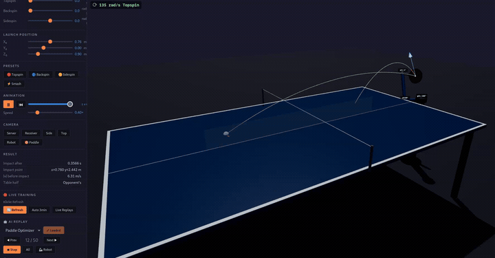

# 🏓 spinoza

A physics-based table tennis simulator with ML-powered return prediction, written in Rust with Python bindings. Spinoza models aerodynamic drag, the Magnus effect, gravity, and realistic bounce mechanics — then trains a reinforcement learning agent to return serves with an optimal paddle position.

Includes a **3D web visualization** with a 4-DOF robot arm that animates the return stroke in real time.

<p align="center">
  
</p>

## Features

- **Physics engine** — RK4 integration at 0.5ms timesteps with drag, Magnus effect, and spin-dependent bounce model
- **Python bindings** — Rust physics exposed via PyO3/maturin for ML training
- **PPO training pipeline** — Train a return agent that selects paddle position, tilt, and swing parameters
- **Trajectory prediction** — LSTM-based predictor estimates ball trajectory from partial observations
- **Paddle optimizer** — Physics-based computation of optimal return paddle placement (83%+ return rate)
- **3D replay viewer** — Three.js visualization with animated robot arm, trajectory trails, bounce markers
- **4-DOF robot arm** — Shoulder yaw/pitch, elbow, and wrist with analytical IK and smooth animation
- **Collision detection** — Table collision warnings with pulsing visual feedback
- **Joint angle labels** — Real-time φ1–φ4 angle display at each joint during animation

## Quick Start

### Web Visualization

Start a local server and open the replay viewer:

```bash
cd web && python3 -m http.server 8000
# Open http://localhost:8000 in your browser
```

Load replays, scrub the timeline, and watch the robot arm animate to the return position.

### CLI

```bash
cargo run -- -v 9 -e 5 --topspin 150
```

```
=== Table Tennis Ball Simulation ===

Launch position: x=0.7625 m  y=0.0000 m  z=0.9000 m
Launch velocity: vx=0.000 m/s  vy=8.966 m/s  vz=0.784 m/s
Spin (ω):        ωx=-150.0 rad/s  ωy=0.0 rad/s  ωz=0.0 rad/s

--- Impact after 0.1685 s ---
Impact point:    x=0.7625 m  y=1.4498 m  (z=0.7600 m)
...
```

### ML Training

```bash
pip install -e .             # Build Rust → Python bindings via maturin
cd training
python train.py              # PPO training with live progress
python export_replays.py     # Export replays for web viewer
```

See [`training/README.md`](training/README.md) for the full training guide.

## CLI Arguments

| Flag | Description | Default |
|------|-------------|---------|
| `-v, --speed` | Launch speed (m/s) | 8.0 |
| `-e, --elevation` | Elevation angle above horizontal (°) | 10.0 |
| `-a, --azimuth` | Azimuth from +Y axis (°, 0 = straight) | 0.0 |
| `--topspin` | Topspin angular velocity (rad/s) | 0.0 |
| `--backspin` | Backspin angular velocity (rad/s) | 0.0 |
| `--sidespin` | Sidespin angular velocity (rad/s) | 0.0 |
| `--x0, --y0, --z0` | Launch position (m) | centre, y=0, z=0.90 |
| `--trajectory` | Print full trajectory as CSV | false |

## Physics Model

### Coordinate System

- **Origin**: Server-side left corner of the table surface
- **+X**: To the right (table width: 0 → 1.525 m)
- **+Y**: Toward the opponent (table length: 0 → 2.74 m)
- **+Z**: Upward; table surface is at z = 0.76 m

### Flight

The ball state is integrated using **RK4** (4th-order Runge-Kutta) at 0.5 ms timesteps. Three forces act on the ball during flight:

- **Gravity**: −9.81 m/s² in Z
- **Drag**: `F_D = −½ · C_D · ρ · A · |v| · v` (C_D = 0.40)
- **Magnus effect**: `F_M = C_L · ρ · A · r · (ω × v)` (C_L = 0.60) — topspin makes the ball dip, backspin makes it float, sidespin curves it sideways

Spin decays slowly via Stokes-like air friction (k_spin ≈ 5×10⁻⁷ N·m·s).

### Bounce

Based on the Gardin / Haake & Goodwill model:

- **Normal restitution**: e_n = 0.93
- **Tangential**: Computes contact-point velocity (including spin), then determines slip vs. grip
  - Friction impulse ≤ μ · normal impulse → **sticking** (rolling contact)
  - Otherwise → **sliding** (kinetic friction, μ = 0.25)
- Spin is updated from the tangential impulse

### Ball Constants (ITTF standard)

- Mass: 2.7 g
- Radius: 20 mm (40 mm diameter)
- Moment of inertia: hollow sphere `I = (2/3)·m·r²`

For a detailed derivation of the differential equations and numerical methods, see [`web/PHYSICS.md`](web/PHYSICS.md).

## Robot Arm

The visualization includes a 4-DOF articulated robot arm mounted behind the table:

| Joint | Symbol | Description |
|-------|--------|-------------|
| Shoulder yaw | φ1 | Rotation around vertical axis to face the ball |
| Shoulder pitch | φ2 | Arm elevation in the vertical plane |
| Elbow | φ3 | Forearm bend (0–180°) |
| Wrist | φ4 | Paddle orientation (quaternion, computed from paddle tilt) |

- **Analytical IK** solves the 2-link arm (upper arm 0.35m + forearm 0.40m) with elbow-up/down options
- **Smooth animation** interpolates from rest pose to hit position using smoothstep easing
- **Paddle geometry** — realistic table tennis paddle with coplanar disc and radial handle
- **Collision detection** — arm segments checked against table volume each frame; violations shown as pulsing red arm + viewport warning banner

## Project Structure

```
src/
  main.rs                CLI entry point
  simulation.rs          Simulation loop (RK4, bounce detection)
  table.rs               ITTF table geometry
  lib.rs                 Library exports + PyO3 feature gate
  pymodule.rs            Python bindings (simulate, apply_paddle_hit, ...)
  physics/
    state.rs             Vec3 and BallState types
    constants.rs         Physical constants
    forces.rs            Gravity + drag + Magnus; spin decay
    integrator.rs        RK4 integrator
    bounce.rs            Bounce model (restitution, friction, spin transfer)
    paddle.rs            Paddle physics (normal, swing velocity, hit)
training/
  train.py               PPO training with live progress
  env.py                 Gymnasium environment wrapping Rust physics
  paddle.py              Paddle optimizer (physics-based return)
  predict.py             LSTM trajectory predictor
  export_replays.py      Export replays for web viewer
  evaluate.py            Evaluate trained models
web/
  index.html             Main UI (replay controls, camera presets)
  PHYSICS.md             Physics documentation
  js/
    main.js              Three.js scene, robot arm, IK, animation, replay system
    physics.js           JS port of the physics engine
scripts/
  capture_demo.js        Puppeteer-based GIF capture for README
```

## Building

Requires Rust 2024 edition (1.85+):

```bash
cargo build --release
```

For Python bindings:

```bash
pip install -e .     # Uses maturin to build with PyO3
```

## License

MIT
